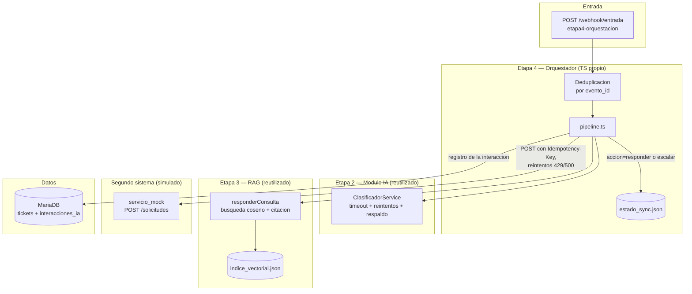

# Arquitectura — Etapa 4: orquestación

## 1. Diagrama de componentes

## 2. Flujo de datos extremo a extremo

1. El segundo sistema (`servicio_mock` u otro origen equivalente) envía un
   evento a `POST /webhook/entrada` de `etapa4-orquestacion`. El evento
   puede llegar duplicado o fuera de orden — no hay garantía de entrega
   única desde el origen.
2. `etapa4-orquestacion` deduplica por `evento_id` contra el registro local
   (`estado_sync.json`): si ya fue visto, responde `200 {duplicado: true}`
   sin reprocesar. Si es nuevo, se marca `pendiente` y se acepta con `202`.
3. El pipeline (`pipeline.ts`) ejecuta, en orden:
   a. **Clasificar** — reutiliza `ClasificadorService` de Etapa 2 (timeout +
      reintentos con backoff exponencial + respaldo heurístico garantizado).
   b. **RAG** — reutiliza `responderConsulta` de Etapa 3 (búsqueda por
      coseno sobre el índice ya construido en la Tarea 6 de Etapa 3 con los
      5 PDF de políticas, 42 fragmentos indexados; cita documento+sección o
      se abstiene bajo el umbral 0.75).
   c. **Decidir** — si la confianza de clasificación cae bajo
      `UMBRAL_ESCALAMIENTO` (0.4, mismo umbral que Etapa 2) o el RAG se
      abstuvo (sin citas), la acción es `escalar`; en otro caso, `responder`.
4. El resultado se registra en `estado_sync.json` (`enviado` en progreso) y
   en la tabla `interacciones_ia` (trazabilidad relacional, Tarea 10).
5. Se envía de vuelta al segundo sistema vía
   `POST {SERVICIO_MOCK_URL}/solicitudes` con cabecera `Idempotency-Key`
   derivada del `evento_id`, con reintentos ante `429`/`500` respetando
   `Retry-After` cuando el mock lo entrega.
6. El estado local pasa a `confirmado` si el envío tuvo éxito, o queda en
   `error` (sin perder el evento) si el mock no está disponible tras agotar
   los reintentos — se puede reintentar manualmente más tarde con el mismo
   registro.

## 3. Secretos y ambientes

- Cada subproyecto Node (`etapa2-api`, `etapa3-rag`, `etapa4-orquestacion`)
  mantiene su propio `.env` (ignorado por git) + `.env.example` (plantilla
  versionada, sin secretos reales).
- `etapa4-orquestacion` agrega dos plantillas adicionales versionadas para
  separar explícitamente configuración por ambiente:
  `.env.development` (apunta a `localhost` para todo — mock, DB, proveedor
  de IA local) y `.env.production` (mismas claves, valores de ejemplo que
  apuntarían a endpoints reales — nunca credenciales reales committeadas).
- Ninguna credencial — incluido el token demo del `servicio_mock`
  (`demo-token-prueba-2026`) — vive hardcodeada en código fuente; siempre
  se lee vía `process.env` a través de `cargarConfig()`, que falla rápido
  con un mensaje claro si falta una variable requerida.
- La única diferencia real entre ambientes en este repo es la URL de los
  servicios externos (`AI_PROVIDER_BASE_URL`, `SERVICIO_MOCK_URL`) y el
  puerto local; no hay lógica condicional por ambiente en el código fuente
  (evita el antipatrón de `if (NODE_ENV === "production")` disperso).
