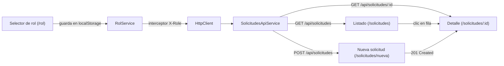

# Cliente Angular de Etapa 2 (fuera del alcance del Anexo A)

Fecha: 2026-08-23 · Depende de: Etapa 2 (`etapa2-api`) ya acreditada.
Rama: `etapa2-frontend`, forkeada de la punta de `etapa2-api` (no depende de nada de las Etapas 3-5).

## 1. Propósito y alcance

Aplicación Angular que consume la API REST de Etapa 2 ya acreditada, para
ejercer sus 3 endpoints (`POST /solicitudes`, `GET /solicitudes`,
`GET /solicitudes/:id`) desde una interfaz real en vez de Swagger UI o
`curl`.

**Esto no es parte de los 5 entregables calificados del Anexo A** — el
enunciado de la prueba técnica no pide un frontend. Es una adición
solicitada aparte, y por eso vive en su propia rama y no se integra a la
cadena de PRs de las 5 etapas. No agrega funcionalidad nueva al backend: el
código de `etapa2-api` no se toca en ningún punto.

## 2. Arquitectura

- **Angular standalone** (sin `NgModule`), generado con **Angular CLI
  21.2.x** — versión real verificada en este entorno: el Node.js instalado
  es `22.19.0`, y la línea más nueva de `@angular/cli` (22.x) exige Node
  `≥22.22.3`/`≥24.15.0`, que este entorno no cumple; `21.2.21` sí es
  compatible (`node: ^20.19.0 || ^22.12.0 || >=24.0.0`) y quedó confirmado
  corriendo `npx @angular/cli@21 version`.
- **Angular Material** (`ng add @angular/material` después de `ng new`)
  para tabla, campos de formulario y notificaciones — evita construir esos
  componentes a mano.
- **`HttpClient`** con un `HttpInterceptorFn` que agrega el header
  `X-Role` a cada petición saliente, leyendo el rol activo desde
  `RolService` (respaldado por `localStorage`).
- **Enrutamiento** con `provideRouter` — 4 rutas: `/rol`,
  `/solicitudes/nueva`, `/solicitudes` (listado), `/solicitudes/:id`
  (detalle).
- **`proxy.conf.json`** reenvía `/api/*` → `http://localhost:3000/*`
  (puerto real de `etapa2-api`, confirmado en `etapa2-api/.env.example`) —
  así el código Angular llama a `/api/solicitudes` y nunca ve el puerto ni
  un problema de CORS en desarrollo. `etapa2-api` no se modifica.
- **Dependencias propias**: `etapa2-frontend/package.json` +
  `package-lock.json` independientes, **fuera** del array `workspaces` del
  `package.json` raíz del monorepo — Angular fija su propia versión de
  TypeScript vía el CLI, y unirlo al workspace npm compartido por
  `etapa2-api`/`etapa3-rag`/etc. arriesgaría un conflicto de versión sin
  ningún beneficio real (este proyecto no reexporta nada que otro
  subproyecto del monorepo vaya a importar).

## 3. Flujo y componentes

- **Selector de rol** (`/rol`): elige entre `solicitante`,
  `responsable_area`, `administrador`, más un nombre/correo libre (se usa
  como valor de `solicitante` al crear una solicitud). Persiste en
  `localStorage`. Es la ruta de entrada si no hay rol guardado
  (`RolGuard` redirige aquí desde cualquier otra ruta). Un botón "Cambiar
  rol" permanece visible en la barra superior en todo momento, para poder
  probar los distintos niveles de permiso sin recargar la app.
- **Nueva solicitud** (`/solicitudes/nueva`, visible para los 3 roles):
  formulario reactivo (`asunto`, `descripcion`, `area`, `solicitante` —
  precargado con el nombre del selector de rol, editable). Al enviar,
  `POST /api/solicitudes`; si `201`, navega al detalle de la solicitud
  recién creada; si `422`, muestra los errores de campo devueltos en
  `details` de la forma de error uniforme de la API.
- **Listado** (`/solicitudes`, visible solo para `responsable_area`/
  `administrador` — un guard de ruta redirige a `/rol` con un mensaje si
  el rol activo es `solicitante`, reflejando el mismo 403 real que daría
  la API): tabla Material con columnas asunto/área/categoría/prioridad/
  estado/fecha; filtros de área/estado/categoría reflejados como query
  params en la URL; paginación simple usando `limite`/`desplazamiento`
  (ya soportados por `GET /solicitudes` desde la revisión final de
  Etapa 2).
- **Detalle** (`/solicitudes/:id`, visible para los 3 roles): muestra
  todos los campos de la solicitud (incluida la clasificación por IA ya
  resuelta server-side: categoría, prioridad, confianza, estado). Si
  `404`, pantalla dedicada de "no encontrada" con enlace de vuelta.

## 4. Manejo de errores

La API ya devuelve una forma uniforme `{ error: { code, message,
details? } }` (`etapa2-api/src/errors.ts`, ya acreditado). Un interceptor
de errores HTTP centraliza la traducción a UI:
- `422` → errores de campo mostrados inline en el formulario que originó
  la petición.
- `403` → snackbar "Tu rol no tiene permiso para esto" + redirección a
  `/rol`.
- `404` → pantalla dedicada (usada por el detalle).
- `5xx` / error de red → snackbar genérico con opción de reintentar la
  última acción.

## 5. Testing

Se usa el generador de pruebas que trae por defecto la versión de Angular
CLI instalada — no se fija a priori si es Karma/Jasmine o un runner más
nuevo; el plan de implementación confirma y documenta el resultado real de
`ng new` al ejecutarlo (Tarea 1).

Cobertura mínima:
- `RolService` (persistencia de rol en `localStorage`).
- El interceptor de `X-Role` (agrega el header correcto según el rol
  activo).
- El interceptor de errores (traduce cada código HTTP a la acción de UI
  descrita en la sección 4).
- Un test de integración por vista usando `HttpTestingController` (sin
  levantar el backend real).

Nota de convención: las Etapas 1-4 de este repo usan **infraestructura
real** en sus pruebas (base de datos, `servicio_mock`, proveedor de IA)
porque son ellas las que la implementan. Este proyecto es distinto: es un
cliente que consume una API ajena a este código — no hay infraestructura
propia que valga la pena levantar en cada corrida de test, así que aquí
`HttpTestingController` (que sí es la forma estándar de Angular de probar
llamadas HTTP sin red real) es la elección correcta, no una relajación de
la convención.

## 6. Fuera de alcance

- No hay autenticación real (el "rol" es una simulación consciente del
  modelo de seguridad real de la API, que tampoco tiene autenticación).
- No se toca `etapa2-api` en ningún punto.
- No hay pipeline de CI para este proyecto — es una demo local, no un
  entregable calificado.
- No hay diseño responsive más allá de lo que Angular Material da por
  defecto.
- No hay persistencia de solicitudes más allá de lo que ya ofrece
  `etapa2-api` (su store en memoria se resetea al reiniciar el backend —
  eso es una limitación heredada, no algo que este frontend intente
  resolver).
